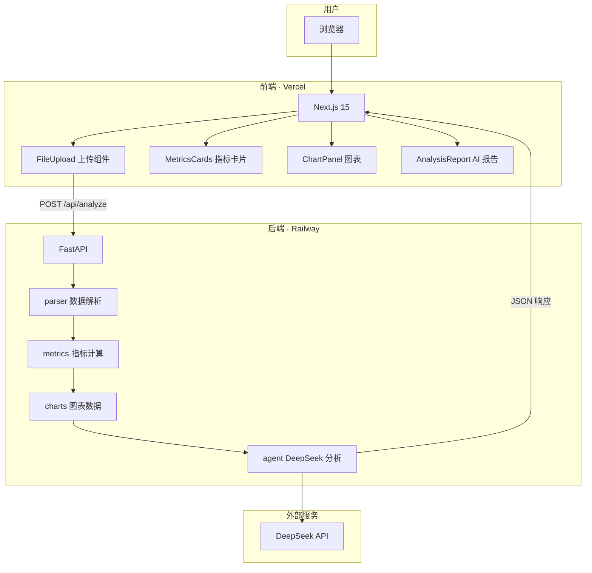
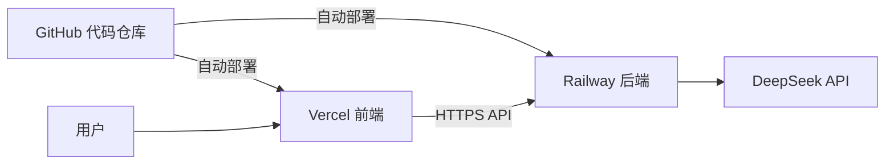
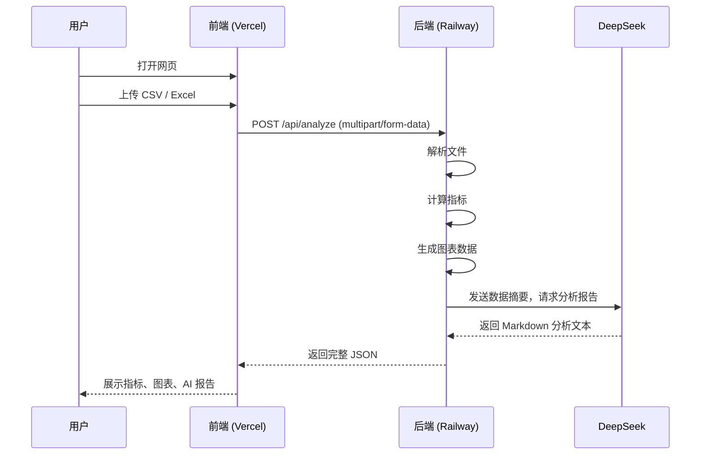

# 数据分析 Agent — 项目说明文档

## 1. 项目简介

**数据分析 Agent** 是一个 Web 应用：用户上传 CSV 或 Excel 表格，系统自动完成数据解析、指标计算、图表生成，并调用 DeepSeek 大模型输出中文分析报告。

| 项目 | 说明 |
|------|------|
| 前端地址（线上） | https://tc-ddagent.vercel.app |
| 后端地址（线上） | https://tc-ddagent.up.railway.app |
| 代码仓库 | https://github.com/Kyrie35/data-analysis-agent |

---

## 2. 系统架构

整体采用 **前后端分离** 架构：前端负责交互与展示，后端负责数据处理与 AI 调用，两者通过 REST API 通信。



### 2.1 架构分层

| 层级 | 技术 | 职责 |
|------|------|------|
| 展示层 | Next.js + React + Tailwind CSS | 页面、上传、结果展示 |
| 图表层 | Recharts | 折线图、柱状图渲染 |
| 接口层 | FastAPI | 接收文件、返回 JSON |
| 数据层 | pandas + openpyxl | CSV/Excel 解析与计算 |
| 智能层 | DeepSeek API | 生成自然语言分析报告 |

### 2.2 部署架构



| 环境 | 平台 | 说明 |
|------|------|------|
| 前端 | Vercel | 托管 Next.js，Root Directory 设为 `frontend` |
| 后端 | Railway | Docker 构建，根目录 `Dockerfile` 指向 `backend/` |
| AI | DeepSeek | API Key 配置在 Railway 环境变量中 |

---

## 3. 项目目录结构

```
data-analysis-agent/
├── frontend/                    # Next.js 前端
│   ├── app/
│   │   ├── page.tsx             # 主页面（上传 + 结果 Dashboard）
│   │   ├── layout.tsx           # 全局布局
│   │   └── globals.css          # 全局样式
│   ├── components/
│   │   ├── FileUpload.tsx       # 文件上传（拖拽 / 点击）
│   │   ├── MetricsCards.tsx     # 关键指标卡片
│   │   ├── ChartPanel.tsx       # Recharts 图表
│   │   └── AnalysisReport.tsx   # AI 分析报告展示
│   └── lib/
│       └── api.ts               # 调用后端 API
│
├── backend/                     # FastAPI 后端
│   ├── main.py                  # 应用入口、CORS 配置
│   ├── routers/
│   │   └── analyze.py           # POST /api/analyze 路由
│   └── services/
│       ├── analyze.py           # 分析流程编排（总入口）
│       ├── parser.py            # 文件解析、列类型识别
│       ├── metrics.py           # 业务指标计算
│       ├── charts.py            # 图表数据结构生成
│       └── agent.py             # DeepSeek AI 分析
│
├── sample_data/
│   └── sales_sample.csv         # 示例销售数据
│
├── docs/
│   └── 项目说明.md              # 本文档
│
├── Dockerfile                   # Railway 部署（构建 backend）
├── railway.toml                 # Railway 配置
├── DEPLOY.md                    # 部署操作指南
└── README.md                    # 快速启动说明
```

---

## 4. 运行流程

### 4.1 用户使用流程



**步骤说明：**

1. 用户在前端选择或拖拽上传 CSV / Excel 文件
2. 前端通过 `fetch` 将文件 POST 到后端 `/api/analyze`
3. 后端依次执行：解析 → 指标 → 图表 → AI 分析
4. 后端返回 JSON，前端渲染 Dashboard
5. 整个过程约 5–20 秒（AI 分析耗时最长）

### 4.2 后端内部处理流程

```
上传文件
    │
    ▼
load_dataframe()          ← parser.py：读取 CSV/Excel，自动识别日期列
    │
    ▼
build_overview()          ← 行数、列名、列类型、前 5 行预览
    │
    ▼
compute_metrics()         ← 合计、平均值、最常见值等
    │
    ▼
generate_charts()         ← 折线图（日期+数值）、柱状图（分类+数值）
    │
    ▼
generate_analysis()       ← 调用 DeepSeek，生成 Markdown 报告
    │
    ▼
返回 JSON 响应
```

### 4.3 图表自动生成规则

| 数据特征 | 生成图表 |
|----------|----------|
| 有日期列 + 数值列 | 折线图：数值列的月度趋势 |
| 有文本列 + 数值列 | 柱状图：各分类的数值对比 |
| 仅有数值列 | 柱状图：数值分布直方图 |

---

## 5. API 说明

### 5.1 健康检查

```
GET /health
```

**响应示例：**

```json
{ "status": "ok" }
```

### 5.2 数据分析（核心接口）

```
POST /api/analyze
Content-Type: multipart/form-data
```

**请求参数：**

| 字段 | 类型 | 说明 |
|------|------|------|
| `file` | File | CSV 或 Excel 文件 |

**响应结构：**

```json
{
  "overview": {
    "filename": "sales_sample.csv",
    "rows": 15,
    "columns": 5,
    "column_names": ["日期", "产品", "地区", "销售额", "订单数"],
    "column_types": { "日期": "date", "产品": "text", "销售额": "number" }
  },
  "preview": [ { "日期": "2025-01-05", "销售额": 12800 } ],
  "metrics": [
    { "label": "销售额 合计", "value": "98,000", "description": "销售额 的总和" }
  ],
  "charts": [
    {
      "type": "line",
      "title": "销售额 月度趋势",
      "x_key": "label",
      "y_key": "value",
      "data": [{ "label": "2025-01", "value": 28040 }]
    }
  ],
  "analysis": {
    "status": "success",
    "content": "### 数据概览\n...",
    "model": "deepseek-chat"
  }
}
```

**`analysis.status` 可能的值：**

| 值 | 含义 |
|----|------|
| `success` | AI 分析成功 |
| `skipped` | 未配置 `DEEPSEEK_API_KEY` |
| `error` | AI 调用失败（指标和图表仍正常返回） |

---

## 6. 环境变量

### 6.1 后端（Railway / 本地 `backend/.env`）

| 变量名 | 必填 | 说明 | 示例 |
|--------|------|------|------|
| `DEEPSEEK_API_KEY` | 是 | DeepSeek API 密钥 | `sk-xxx` |
| `DEEPSEEK_MODEL` | 否 | 模型名称 | `deepseek-chat` |
| `ALLOWED_ORIGINS` | 是（线上） | CORS 允许的前端域名 | `https://tc-ddagent.vercel.app,http://localhost:3000` |

> 代码中已内置 `*.vercel.app` 域名正则匹配，Vercel 部署的前端可自动通过 CORS 校验。

### 6.2 前端（Vercel / 本地 `frontend/.env.local`）

| 变量名 | 必填 | 说明 | 示例 |
|--------|------|------|------|
| `NEXT_PUBLIC_API_BASE_URL` | 是（线上） | 后端 API 地址 | `https://tc-ddagent.up.railway.app` |

> `NEXT_PUBLIC_` 前缀的变量会在构建时写入前端代码，修改后必须重新 Deploy 才生效。  
> **不要**勾选 Sensitive（该变量本身会暴露给浏览器）。

---

## 7. 本地开发

### 7.1 环境要求

- Node.js 18+
- Python 3.10+

### 7.2 启动步骤

**终端 1 — 后端：**

```bash
cd backend
cp .env.example .env          # 填入 DEEPSEEK_API_KEY
python3 -m venv .venv
source .venv/bin/activate
pip install -r requirements.txt
uvicorn main:app --reload --port 8000
```

**终端 2 — 前端：**

```bash
cd frontend
npm install
npm run dev
```

**访问：** http://localhost:3000

### 7.3 本地调试后端 API

- 健康检查：http://localhost:8000/health
- 交互式文档：http://localhost:8000/docs

---

## 8. 线上部署

详细步骤见 [DEPLOY.md](../DEPLOY.md)。

**部署后检查清单：**

- [ ] Railway `/health` 返回 `{"status":"ok"}`
- [ ] Vercel 配置了 `NEXT_PUBLIC_API_BASE_URL`
- [ ] Vercel 环境变量修改后已 Redeploy
- [ ] Railway `ALLOWED_ORIGINS` 包含 Vercel 域名
- [ ] 上传测试文件，指标、图表、AI 报告均正常

---

## 9. 常见问题

| 现象 | 原因 | 处理 |
|------|------|------|
| `Load failed` | 前端连不上后端，或 CORS 拦截 | 检查 `NEXT_PUBLIC_API_BASE_URL`、Railway CORS、Redeploy |
| AI 报告「未配置 Key」 | 后端未读取 `DEEPSEEK_API_KEY` | 检查 Railway Variables，Redeploy |
| `Address already in use` | 8000 端口被占用 | `lsof -ti:8000 \| xargs kill -9` 后重启 |
| Vercel 变量保存后显示为空 | 误勾 Sensitive，或需 Redeploy | 重建变量（不勾 Sensitive），Redeploy |
| Railway 构建失败 | Root Directory 配置错误 | 留空，使用根目录 `Dockerfile` |

---

## 10. 技术选型说明

| 选择 | 原因 |
|------|------|
| Next.js | 主流 React 框架，Vercel 一键部署 |
| FastAPI | Python 生态，与 pandas / AI SDK 配合好 |
| pandas | CSV/Excel 解析与统计的行业标准 |
| Recharts | React 生态下易用的图表库 |
| DeepSeek | 中文分析效果好，API 成本低 |
| Vercel + Railway | 免费额度够用，GitHub 自动部署 |

---

## 11. 后续可扩展方向

- 用户登录与历史记录
- 支持 PDF / JSON 导出
- 自然语言问答（「哪个月销售额最高？」）
- 多文件对比分析
- 自定义指标规则配置
